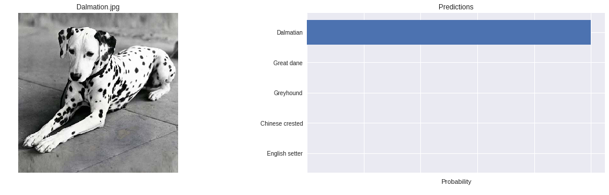
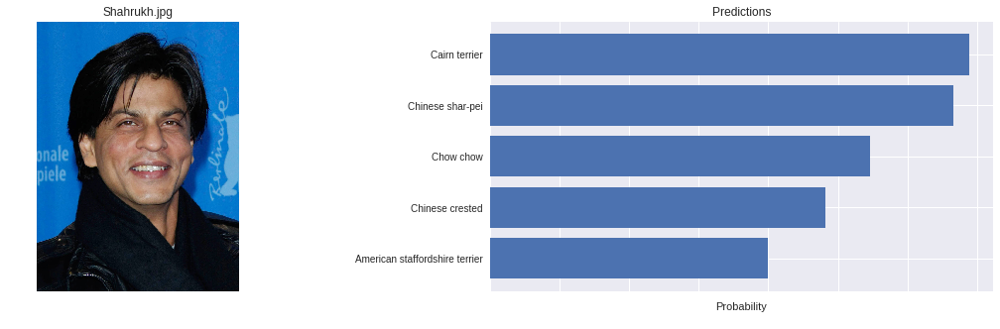

# Dog-Breed-Recognition

In this project, I have bult a pipeline to process real-world, user supplied images. A pipeline that can be used within a web or mobile app.
Given an image of a dog, our algorithm will idenity an estimate of the canine's breed.  If supplied an image of a human, the code will identify the resembling dog breed.

- The datasets that we are using is of [dogs](https://s3-us-west-1.amazonaws.com/udacity-aind/dog-project/dogImages.zip) and [humans](https://s3-us-west-1.amazonaws.com/udacity-aind/dog-project/lfw.zip) to distinguish between them.

- We used OpenCV's implementation of [Haar feature-based cascade classifiers](http://docs.opencv.org/trunk/d7/d8b/tutorial_py_face_detection.html) to detect human faces in images. OpenCV provides many pre-trained face detectors, stored as XML files on [github](https://github.com/opencv/opencv/tree/master/data/haarcascades). We have downloaded one of these detectors and stored it in the haarcascades directory.

- We used a [pre-trained model](http://pytorch.org/docs/master/torchvision/models.html) to detect dogs in images. Specifically VGG-16 model, along with weights that have been trained on [ImageNet](http://www.image-net.org/), a very large, very popular dataset used for image classification and other vision tasks. ImageNet contains over 10 million URLs, each linking to an image containing an object from one of [1000 categories](https://gist.github.com/yrevar/942d3a0ac09ec9e5eb3a).

- We also used our own custom CNN. Sample CNN...

The following links may be of great interest for learning:
1. [Convolutional Neural Network With PyTorch](https://www.kaggle.com/juiyangchang/cnn-with-pytorch-0-995-accuracy)
2. [How To Improve Deep Learning Performance](https://machinelearningmastery.com/improve-deep-learning-performance/)
3. [A Beginner’s Guide to Recurrent Networks and LSTMs](https://deeplearning4j.org/lstm.html)
4. [Introduction to Recurrent Neural Networks in Pytorch](https://www.cpuheater.com/deep-learning/introduction-to-recurrent-neural-networks-in-pytorch/)
5. [Understanding LSTM Networks](http://colah.github.io/posts/2015-08-Understanding-LSTMs/)

---

## Further Resources and Imrpovements

- If you have time, I highly suggest you check out this article about [Dog breed classification that utilizes CNN](http://cs231n.stanford.edu/reports/2015/pdfs/fcdh_FinalReport.pdf). It is an in-depth study that would help you understand how CNN works in classifying dog breeds. It is quite similar to the project so you might have an easier time understanding this due to your acquired knowledge.
- Here is a [study](https://www.ams.giti.waseda.ac.jp/data/pdf-files/2017_IEVC_watabe.pdf) that utilized Data Augmentation using [GAN](https://julianzaidi.wordpress.com/2017/04/24/deep-convolution-gan-dcgan-architecture-and-training/) in classifying breeds.
- A good strategy to improve on the accuracy of the network could be to add dropout layers in the model in order to reduce overfitting.
- [A Gentle Introduction to Dropout for Regularizing Deep Neural Networks](https://machinelearningmastery.com/dropout-for-regularizing-deep-neural-networks/)
- [Dropout Regularization in Deep Learning Models With pytorch](https://www.programcreek.com/python/example/107689/torch.nn.Dropout)
- [Loss functions and optimization algorithms](https://medium.com/data-science-group-iitr/loss-functions-and-optimization-algorithms-demystified-bb92daff331c) for deep learning models may help you understand further the uses of these functions and algorithms. This is a nice article that would help expand your knowledge about them.
- I would like to share this [article](https://datascience.stackexchange.com/questions/20104/how-to-improve-my-test-accuracy-using-cnn-in-tensorflow) with you wherein the discussion is improving the accuracy using CNN.
- [ResNet50](https://www.quora.com/What-is-the-deep-neural-network-known-as-%E2%80%9CResNet-50%E2%80%9D) is also a popular choice and here is a nice article which discusses it further. You may opt to use it someday since it is one of the most popular pre-trained models.
- Also, try using the other bottleneck features and compare the results obtained. Xception, for example, outperforms the others.
- [1n Convolutional Neural Networks for Visual Recognition](http://cs231n.github.io/transfer-learning/)
- [When you should use Transfer Learning](https://towardsdatascience.com/transfer-learning-946518f95666)
- [Transfer Learning Introduction](https://www.hackerearth.com/practice/machine-learning/transfer-learning/transfer-learning-intro/tutorial/)
- [How does one choose optimal number of epochs?](https://www.researchgate.net/post/How_does_one_choose_optimal_number_of_epochs)
- [How to train your Deep Neural Network](http://rishy.github.io/ml/2017/01/05/how-to-train-your-dnn/)
- [Number of epochs to train on](http://forums.fast.ai/t/number-of-epochs-to-train-on/185)

